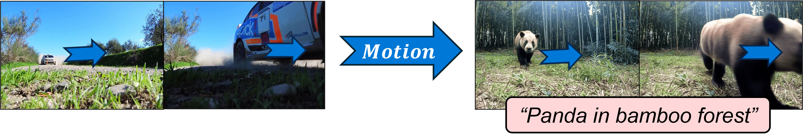
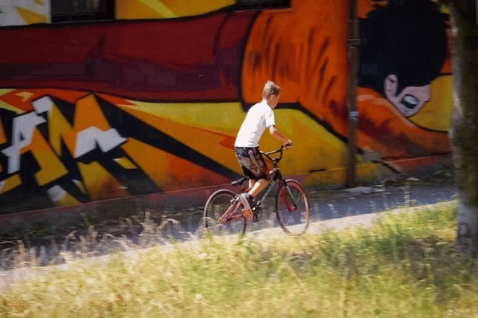
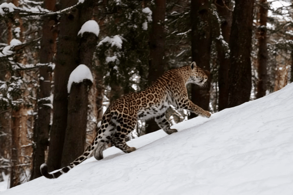
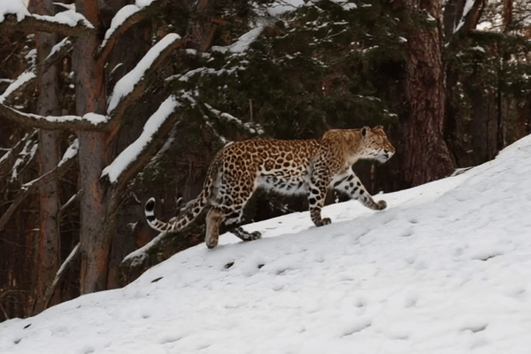
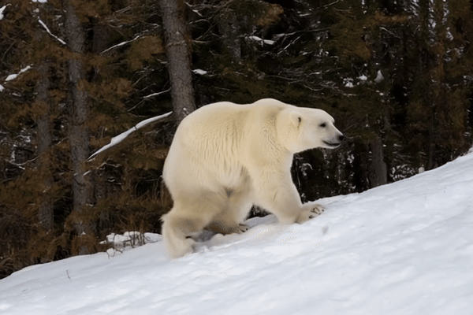

<div align="center">

## Video Motion Transfer with Diffusion Transformers [CVPR 2025]

<p>
⚡ <b> Training-free </b> &nbsp;&nbsp;&nbsp;&nbsp;&nbsp;&nbsp;&nbsp;&nbsp;&nbsp;&nbsp;&nbsp;
⚙️ <b> Optimization-based </b> &nbsp;&nbsp;&nbsp;&nbsp;&nbsp;&nbsp;&nbsp;&nbsp;&nbsp;&nbsp;
🔄 <b> Zero-shot injection</b>
</p>

<a href="https://arxiv.org/abs/2412.07776"></a> &nbsp;&nbsp;&nbsp;&nbsp;&nbsp;
<a href="https://ditflow.github.io"></a>

Official PyTorch implementation of DiTFlow for CogVideoX models

</div>

## Transfer motion from video to new content



🔍 **AMF Extraction**: Process reference videos through pre-trained DiT to extract Attention Motion Flow (AMF)

⚙️ **Motion Optimization**: Guide latent denoising with AMF loss in a training-free manner to reproduce reference motion

🔄 **Zero-shot Motion Injection**: Optimized transformer positional embeddings can be *injected in new generation* for zero-shot motion transfer

📊 **Evaluation**: Outperforms existing methods (<a href="https://arxiv.org/abs/2405.14864v2" target="_blank">MOFT</a>, <a href="https://github.com/diffusion-motion-transfer/diffusion-motion-transfer" target="_blank">SMM</a>) across multiple metrics and human evaluation when implemented for DiTs

## News 📰
**[27/03/2025]** 🎉🎉🎉 Official PyTorch implementation for DiTFlow released for CogVideoX models together with baseline MOFT and SMM methods. Arxiv paper updated with new results.

**[08/03/2025]** 🎸🎸🎸 DiTFlow accepted to CVPR 2025 in Nashville!

**[10/12/2024]** 🔥🔥🔥 Our paper, *Video Motion Transfer with Diffusion Transformers*, has been archived.

## Quick Start 🤗
Experiments were run on an NVIDIA A40 GPU with 48GB memory, where generations took ~8 minutes per output. Best results were obtained with the larger CogVideoX-5B model (this requires more memory).

### 1. Environment Setup
```
git clone https://github.com/ditflow/ditflow.git
cd ditflow
conda create --name ditflow python=3.10
conda activate ditflow
pip install -r requirements.txt
```

### 2. Run Motion Transfer ⚙️

Transfer motion from a reference video to a new video in `results.mp4`.

**Arguments**
- `--video_path`: Path to reference video (e.g. `assets/bmx-trees.mp4`, `assets/lucia.mp4`, `assets/rallye.mp4`)
- `--prompt`: Prompt for new generation

**Example command**
```
python motion_guidance.py --video_path ./assets/bmx-trees.mp4 --prompt "Leopard running up a snowy hill in a forest"
```

| Reference Video | Generated Result |
|:--------------:|:----------------:|
|  |  |

**Optional arguments**
- `--video_length`: Number of frames to load from video from start
- `--loss_type`: Loss type for guidance (`flow`, `moft`, `smm`)
- `--opt_mode`: Optimization mode (`latent`, `emb`)
- `--model`: ID of CogVideoX model to use (`5b` or `2b`)
- Run `python motion_guidance.py -h` for more arguments

**Setups seen in paper**
- (default) DiTFlow (-z<sub>t</sub>): `--loss_type flow --opt_mode latent`
- DiTFlow (-ρ<sub>t</sub>): `--loss_type flow --opt_mode emb`
- SMM: `--loss_type smm --opt_mode latent`
- MOFT: `--loss_type moft --opt_mode latent`
- Injection (No guidance + KV injection): `--no_guidance`
- Backbone (No guidance): `--no_guidance --no_injection`

**Tune parameters in `configs/guidance_config.yaml` for improved motion transfer (might lead to unstable optimization)**
- `lr`: Increase learning rate upper and lower bounds e.g. `[0.002,0.001] -> [0.004,0.002]`
- `optimization_steps`: Increase number of optimization steps per denoising step e.g. `5 -> 10`
- `guidance_timestep_range`: Change number of denoising timesteps with guidance e.g. `[50,40] -> [50, 30]`

### 3. Run Zero-shot Injection Motion Transfer 🔄
*After* optimizing the embeddings when running motion transfer (see previous step), we can inject these into the generation with a new prompt.

**Example command**

Optimize positional embeddings (saved in `results/results.mp4`)
```
python motion_guidance.py --video_path ./assets/bmx-trees.mp4 --prompt "Leopard running up a snowy hill in a forest" --opt_mode emb
```

Inject embeddings with new prompt (saved in `results/results_inject_embeds.mp4`)
```
python motion_guidance.py --video_path ./assets/bmx-trees.mp4 --prompt "Polar bear walking up a snowy hill in a forest" --opt_mode emb --inject_embeds
```

| Optimization output | Injection output |
|:-----------------:|:----------------:|
|  |  |

### 4. Evaluation scripts 📊
Image Quality (IQ) score
```
python eval/clip_score.py --video_path ./results/results.mp4 --prompt "Leopard running up a snowy hill in a forest"
```

Motion Fidelity (MF) score
```
python eval/motion_fidelity_score.py --video_path ./results/results.mp4 --original_video_path ./results/original.mp4
```

## Citation
```
@inproceedings{pondaven2025ditflow,
      title={Video Motion Transfer with Diffusion Transformers}, 
      author={Alexander Pondaven and Aliaksandr Siarohin and Sergey Tulyakov and Philip Torr and Fabio Pizzati},
      booktitle={CVPR},
      year={2025}
}
```

## Acknowledgements
Our codebase builds on the <a href="https://github.com/diffusion-motion-transfer/diffusion-motion-transfer" target="_blank">Space-Time Diffusion Features (SMM)</a> repo for the optimization code and customizes <a href="https://github.com/THUDM/CogVideo" target="_blank">CogVideoX</a> diffusers methods. We implement <a href="https://arxiv.org/abs/2405.14864v2" target="_blank">MOFT</a> and <a href="https://github.com/diffusion-motion-transfer/diffusion-motion-transfer" target="_blank">SMM</a> for DiTs. Sample reference videos (and dataset in paper) are from <a href="https://github.com/davisvideochallenge/davis-2017" target="_blank">DAVIS</a>.

