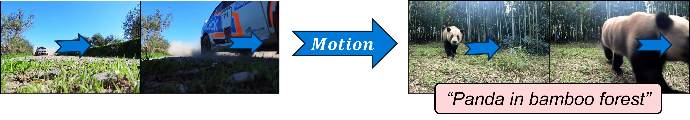

## Video Motion Transfer with Diffusion Transformers

⚡ <b> Training-free </b> &nbsp;&nbsp;&nbsp;&nbsp;&nbsp;&nbsp;&nbsp;&nbsp;&nbsp;&nbsp;&nbsp;
⚙️ <b> Optimization-based </b> &nbsp;&nbsp;&nbsp;&nbsp;&nbsp;&nbsp;&nbsp;&nbsp;&nbsp;&nbsp;
🔄 <b> Zero-shot injection</b>

 &nbsp;&nbsp;&nbsp;&nbsp;&nbsp;

<!-- Official PyTorch implementation of DiTFlow for CogVideoX models -->

**Code release coming soon...**

## Transfer motion from video to new content

🔍 **AMF Extraction**: Process reference videos through pre-trained DiT to extract Attention Motion Flow (AMF)

⚙️ **Motion Optimization**: Guide latent denoising with AMF loss in a training-free manner to reproduce reference motion

🔄 **Zero-shot Motion Injection**: Optimized transformer positional embeddings can be *injected in new generation* for zero-shot motion transfer

📊 **Evaluation**: Outperforms existing methods (<a href="https://arxiv.org/abs/2405.14864v2" target="_blank">MOFT</a>, <a href="https://github.com/diffusion-motion-transfer/diffusion-motion-transfer" target="_blank">SMM</a>) across multiple metrics and human evaluation when implemented for DiTs

## News 📰
**[10/12/2024]** 🔥🔥🔥 Our paper, *Video Motion Transfer with Diffusion Transformers*, has been archived.
